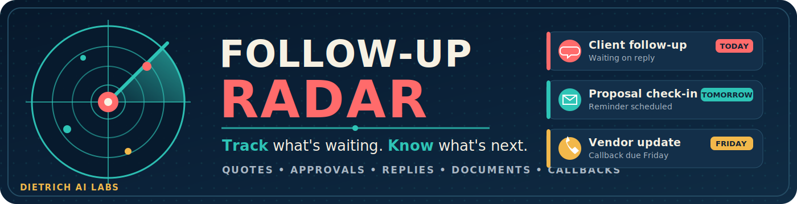

# Follow-Up Radar 1.0.0

**See what is waiting. Know what is next. Close the loop.**

Follow-Up Radar is a local Windows productivity app for tracking quotes,
approvals, customer replies, documents, callbacks, project updates, and every
other task that is waiting on another person or waiting on you.

It puts overdue items first, shows what is due today and this week, keeps an
activity history, and makes it easy to reschedule, close, reopen, export, or
copy a quick follow-up message.

## Features

- Dashboard counts for overdue, due today, next seven days, active, and completed items
- Search by title, person, company, category, tags, notes, status, or channel
- Filter by urgency, status, priority, category, and direction
- Track whether you are waiting on them or they are waiting on you
- Priorities from Low through Critical
- Follow-up date and optional recurrence interval
- One-click Today, +1, +3, and +7 date controls
- Snooze by one, three, or seven days
- Mark contacted and automatically schedule the next recurrence
- Complete and reopen items
- Per-item activity timeline
- Contact, company, communication channel, notes, tags, and related link
- Copy a ready-to-edit follow-up message
- Open related web links
- Atomic local JSON storage
- Automatic backups before changes
- Restore the latest backup
- JSON and CSV import/export with merge or replace modes
- No account, cloud service, telemetry, or subscription

## Local data

The current Windows user's data is stored under:

```text
%LOCALAPPDATA%\Dietrich AI Labs\Follow-Up Radar
```

This contains:

```text
follow_ups.json
Backups\
Exports\
```

Uninstalling the app preserves the user's follow-up library and backups.

## Run from source

```text
RUN_FOLLOW_UP_RADAR.bat
```

The runtime uses only Python standard-library modules.

## Build the complete Windows release

Double-click:

```text
BUILD_FOLLOW_UP_RADAR.bat
```

The automated builder performs:

- Windows PowerShell ASCII and parser preflight
- isolated Python build environment
- automated tests
- custom icon generation
- one-file windowed EXE build with icon and version metadata
- reusable Dietrich AI Labs self-signing certificate
- EXE signing and verification
- Inno Setup installation when missing
- current-user Windows installer
- installer, application, shortcut, and uninstall icons
- EULA acceptance page
- Start Menu shortcut and optional desktop shortcut
- installed README, changelog, EULA, license, notices, and public certificate
- installer signing and verification
- portable, installer, and complete ZIP packages
- SHA256 checksums, release notes, manifest, signature report, and build record
- ZIP-only `Release Ready` folder

Detailed output:

```text
Release\v1.0.0
```

Normal Windows installer:

```text
Release\v1.0.0\Follow_Up_Radar_Setup_1.0.0.exe
```

GitHub-ready packages:

```text
Release\Release Ready
├── Follow_Up_Radar_Portable_1.0.0.zip
├── Follow_Up_Radar_Installer_1.0.0.zip
└── Follow_Up_Radar_Complete_1.0.0.zip
```

## Installer behavior

The installer:

- requires no administrator rights for normal current-user installation
- installs under `%LOCALAPPDATA%\Programs\Follow-Up Radar`
- displays `EULA.txt` before installation
- installs the EXE, icons, README, changelog, EULA, license, notices, and public certificate
- creates a Start Menu shortcut
- can create an optional desktop shortcut
- can launch Follow-Up Radar when setup completes
- registers a normal Windows **Installed apps** uninstall entry
- preserves user follow-up data and backups when uninstalled

## Signing notice

The app and installer are self-signed. Windows SmartScreen may still display an
Unknown Publisher warning on another computer until the public certificate is
trusted or a publicly trusted signing certificate is used.

Verify the release source and included SHA256 checksums.

## Publisher

**Dietrich AI Labs**
